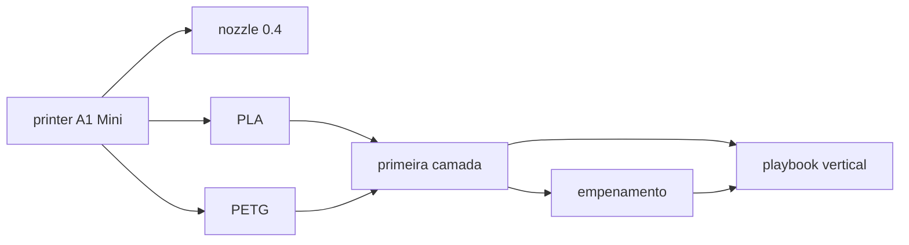

# Mapa de conhecimento

## Entradas por intenção

| Intenção | Hub inicial |
|---|---|
| Sintoma / falha | [12-problemas](../12-problemas-e-diagnostico/INDEX.md) |
| Tecnologia | [02-tecnologias](../02-tecnologias/INDEX.md) |
| Impressora | [21-impressoras](../21-impressoras/INDEX.md) |
| Material | [05-materiais](../05-materiais/INDEX.md) |
| Setting / slicer | [08-slicers](../08-slicers-e-configuracoes/INDEX.md) |
| Objetivo / cenário | [16-cenarios](../16-cenarios-e-playbooks/INDEX.md) |
| Segurança | [15-seguranca](../15-seguranca-e-meio-ambiente/INDEX.md) |
| Fonte | [22-fontes](../22-fontes/INDEX.md) |
| Termo | [23-glossario](../23-glossario/INDEX.md) |

## Fatia vertical Wave 0/1 (canônica)

## Corpus legado (não canônico novo)

| Path | Papel |
|---|---|
| `docs/projeto/` | Wiki operacional EN A1 Mini — keep-and-enrich / migrate |
| `docs/ebook/` | Guia Maker pt-BR CC BY-SA — archive navigation, reuse sob licença |
| `docs/printers/` | Manuais convertidos |
| `docs/_arquivo/` | Originais — não editar |
| `docs/context.md` | Resumo de chat F.2 — não é KB AM |
| `docs/superpowers/` | Specs de design de feature — fora da taxonomia AM |

Detalhe: [inventario-existente.md](inventario-existente.md).
