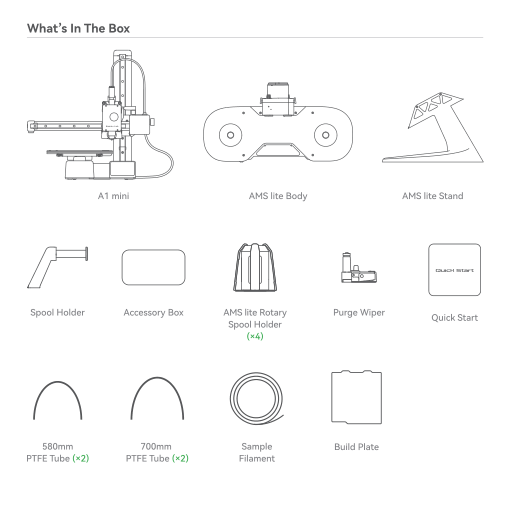
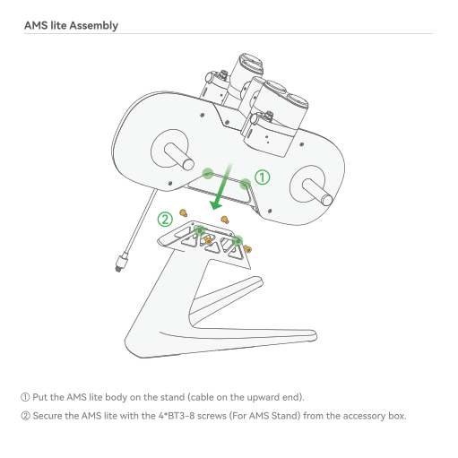
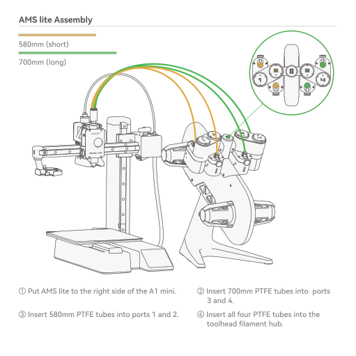
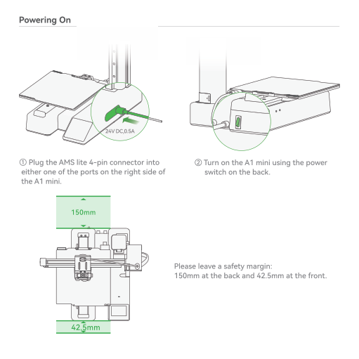
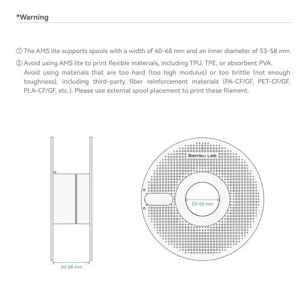
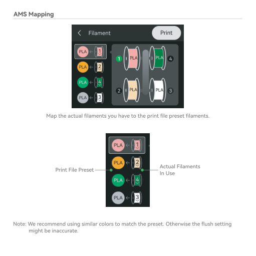

# A1 Mini — Quick Start — Combo (with AMS Lite)

> **Hardware:** Bambu Lab A1 Mini  
> **Archived PDF:** [`docs/_arquivo/printers/A1mini/a1-mini-quick-start-guide-combo.pdf`](../../_arquivo/printers/A1mini/a1-mini-quick-start-guide-combo.pdf)  
> **Official wiki:** https://wiki.bambulab.com/en/a1-mini/manual  
> **Conversion note:** Adobe Illustrator PDF (vector text); `pypdf` text layer empty — recovered via OCR. Original document language preserved in extracted body.

## Extracted content (by page)

### Página 1

—ambu Lab RI mini 1-uitñ Lite Quick Start Please review the entire guide before operating the printer. * Safety Notice: Do not connect to power until assembly is complete. 0 PF002-M 0 SA005

### Página 2

Bambu Studio & Bambu Handy https://bambulab.com/download

### Página 3

What's In The Box Al mini O AMS lite Body AMS lite Rotary Spool Holder Sample Filament O Spool Holder 580mm PTFE Tube (0) Accessory Box 700mm PTFE Tube (0) AMS lite Stand Purge Wiper Quick Start Build Plate

### Página 4

Accessory Box Unclogging Pin Tool Allen Key H2 Allen Key Hl .5 o o Cable Organizer BT2.6-8 Screw (Q) (For Scraper) Bambu Scraper Blade BT3-8 Screw 05) (For AMS Stand) Spool Holder Base M3-8 Screw (Q) (For Spool Holder) Grease & Oil M3-12 Screw (XI) (For Purge Wiper)

### Página 5

Unlock @ Remove the 4 screws to unlock the Z-axis limiter. @ Cut the ziptie wrapped around the toolhead. @ Remove the foam padding.

### Página 6

Lock Heatbed o @Tighten the 3 screws circled in green to lock the heatbed.

### Página 7

Purge Wiper Installation @ Slide in the Purge Wiper unit into the slot at the end of the X-Axis. @ Install the 1*M3-12 screw (For Purge Wiper) from the accessory box to fix the Purge Wiper in place.

### Página 8

Spool Holder Installation O Install the spool holder base plate with the 2*M3-8 screws (For Spool Holder) from the accessory box. @ Slide in the spool holder (match the slot orientation).

### Página 9

AMS lite Assembly O Put the AMS lite body on the stand (cable on the upward end). @ Secure the AMS lite with the 4*BT3-8 screws (For AMS Stand) from the accessory box.

### Página 10

AMS lite Assembly Green Yellow Green Yellow @ Slide the rotary spool holders on (all the way in), being careful to match colors to avoid damaging any parts.

### Página 11

AMS lite Assembly 580mm (short) 700mm (long) O @ Put AMS lite to the right side of the Al mini. @ Insert 580mm PTFE tubes into ports 1 and 2. 1 1 @ Insert 700mm PTFE tubes into ports 3 and 4. @ Insert all four PTFE tubes into the toolhead filament hub.

### Página 12

Organizer Installation Black Cable O O Install the organizer as shown in the diagram. O The other four holes are for PTFE tubes. 50mm @ Clip the black cable into the smaller hole. (Recommend distance between Al mini and AMS lite is 50mm as shown in the diagrama)

### Página 13

Powering On DC,O.5A @ Plug the AMS lite 4-pin connector into either one of the ports on the right side of theA1 mini. 150mm 42.5mm @Turn on the Al mini using the power switch on the back. Please leave a safety margin: 150mm at the back and 42.5mm at the front.

### Página 14

Network Setting < Network Connect to Network Select Wi-Fi This Step could enable you to send printing from phone, computer. Skip Follow the instructions untill you See this screen. Press "Select Wi-Fi" to search for available network. Select Wi-Fi (only for 2.4G) Wi-Fi SSID 1 Wi-Fi SSID 2 Wi-Fi SSID 3 Wi-Fi SSID 4 @ Select your preferred network. 1/2 Wi-Fi Passcode q w s ABC Z e x c h V b OK o k n p m @ Input the passcode, and then press "OK"

### Página 15

Printer Binding @ Download the Bambu Handy App. Register and log in to your Bambu Lab account. @ Use Bambu Handy to scan the QR code on the screen, and bind your printer to your Bambu Lab account. @ Follow the instructions on the screen to complete the initial calibration. lt is normal to have vibration and noise during the calibration process. Download Bambu Han < Login the account Use Bambu Handy App to scan and log in This Step could enable you to send printing from phone, computer and Makerworld! QR Code

### Página 16

Spool Loading • oooaaooooooooaa 00000 00000.. Bambu Lab 0000000 a 00. • oooooaaa • 000000000000000 • Bambu Lab 0000000000 0000000000 0000000000 @ Orient spool installation according to the filament winding direction on (as shown in the diagram).

### Página 17

*Warning O The AMS lite supports spools with a width of 40-68 mm and an inner diameter of 53-58 mm. @ Avoid using AMS lite to print flexible materials, including TPU, TPE, or absorbent PVA. Avoid using materials that are too hard (too high modulus) or too brittle (not enough toughness), including third-party fiber reinforcement materials (PA-CF/GF, PET-CF/GF, PLA-CF/GF, etc.). Please use external spool placement to print these filament. ao 000000000000 00000 o Bambu Lab 00000000000000000 000000000000000000000000000 • e 000000000000000000000000000000 • 00000000000000 ooooooaooooaoooo. • 00000000000 00000000000 c OOCOOOOeo 0000000000 0 000000000000 • 00000000000 53-58 mm 0000000000000 00000000000 0 0 00000000 o OeOOOOoOOe cc 000000000 0000000000000 00000000000a 0000000000000000000000000 • e 00000000000000000000000000 • 0000000000000000000000000 • • 00000000000 00000000000000 40-68 mm

### Página 18

Spool Loading Note: Press the release button to disengage drive motor if filament stuck. 6 9 9 O Push the spool all the way onto the spool retractor. Make sure it fully click into place. @ Feed the filament into the filament inlet.

### Página 19

External Spool (for non-AMS use case) O o o @ Connect the toolhead filament inlet (either one of four) and the filament guide with the PTFE tube as shown in the diagram. @ Hang filament spool on spool holder then feed the filament line into the PTFE tube as shown in the diagram.

### Página 20

First Print Filament Print Files Control Setting IE43•c Assistant SpeedBoatRace_ Bambu PLA 3DBenchy 3coIor Version 3D Bency by Creative Tool 1/2 Squishy turtle by Jake. code @ Press "Print Files" to access the preloaded models on the SD card. 3D Bench PLA Next @1h3m L170g Use AMS Timelapse Bed Leveling Flow Dynamics Calibration @ Select the model you want to print. @Turn on "Use AMS" if you are using filaments on AMS. Turning on "Bed leveling" is recommended. Turn on "Timelapse" for timelapse video recording.

### Página 21

AMS Mapping < Filament Print PLA PLA PLA 9) PLA p Map the actual filaments you have to the print file preset filaments. PLA PLA Print File Preset — PLA Actual Filaments In Use 3 Note: We recommend using similar colors to match the preset. Otherwise the flush setting might be inaccurate.

### Página 22

Specification Body Toolhead Heatbed Speed Cooling Supported Filament Sensors Physical Dimensions Item Printing Technology Build Volume (WxDxH) Chassis Hot End Extruder Gears Nozzle Max Hot End Temperature Nozzle Diameter (Included) Nozzle Diameter (Optional) Filament Cutter Filament Diameter Compatible Build Plate Max Build Plate Temperature Max Speed of Tool Head Max Acceleratian Of Tool Head Max Hot End Flow Part Cooling Fan Hot End Fan MC Board Cooling Fan PLA, PETG, TPI_J. PVA ABS. ASA, PC, PA, PET, Carbon/Glass Fiber Reinforced Polymer Monitoring Camera Filament Run Out Sensor Filament Odometry Power Loss Recover Filament Tangle Sensor Dimensions Net Weight Specification Fused Deposition Modeling Steel Extruded Aluminum All-Metal Stainless Steel 300 oc mm mm, mm, 0.8 mm Yes 1.75 mm Bambu Textured PEI Plate E3ambu Smooth PEI Plate 80 oc 500 mm/s 10000 mm,'s2 28 mm3/s @ABS (Modeli 1508150 mm single walli Material: Bambu ABS Temperatura 280 'C) Closed Loop Control Closed Loop Control Closed Loop Control Ideal Not Recommended Low Rate Camera (up tol 080P) Timelapse Supported Yes Yes Yes Yes 347'315*365 mm,'

### Página 23

Specification Electrical parameters Electronics Software Wi-Fi Bambu Studio Bambu Handy Input Voltage Max power Display Connectivity Storage Control Interface Motion Controller Slicer Slicer Supported OS Frequency Range Transmitter Power (EIRP) Protocol 100-240 50/60 Hz 150 w 2_4 inches 320'240 IPS Touch Screen Wi-Fi, Bambu-Bus Micro SD Card Touch Screen, APP. PC Application Dual-Core Cortex M4 Bambu Studio Support third party slicers Which export standard Geode such as SuperSlicer, PrusaSIicer and Cura, but certain advanced features may not be supported. MacOS, Windows 2412 MHz - 2472 MHz (CE) 2412 MHz - 2462 MHz (FCC) 2400 MHz - 24838 MHz (SRRC) 21.5 dBm (FCC) s 20 dBm (CE/SRRC) IEEE 802.11 b/g/n https://bambulab.com/download

### Página 24

*(sem texto recuperável nesta página — possível capa/ilustração)*

## Figuras de referência (páginas renderizadas)

- 
- 
- 
- 
- 
- 
