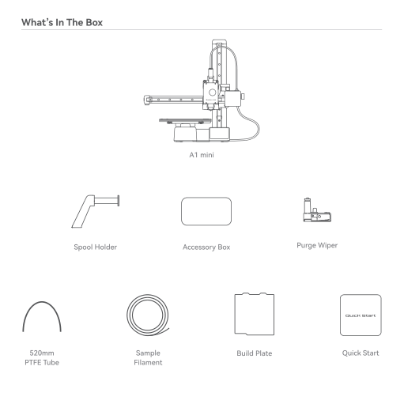
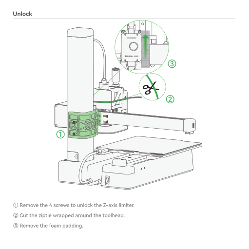
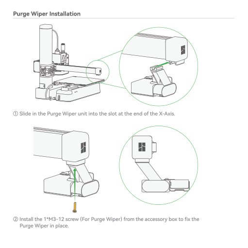
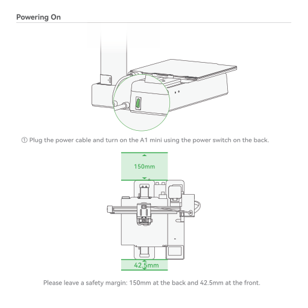
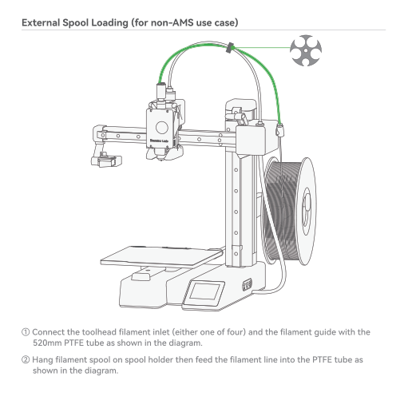
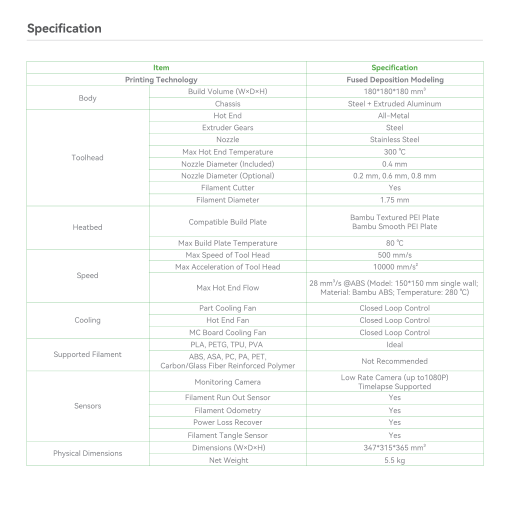

# A1 Mini — Quick Start — standalone (no AMS)

> **Hardware:** Bambu Lab A1 Mini  
> **Nota:** PDF arquivado removido com `docs/_arquivo/`.  
> **Official wiki:** https://wiki.bambulab.com/en/a1-mini/manual  
> **Conversion note:** Adobe Illustrator PDF (vector text); `pypdf` text layer empty — recovered via OCR. Original document language preserved in extracted body.

## Extracted content (by page)

### Página 1

—ambu Lab auick Start Please review the entire guide before operating the printer. * Safety Notice: Do not connect to power until assembly is complete. PF002-M

### Página 2

Bambu Studio & Bambu Handy https://bambulab.com/download

### Página 3

What's In The Box Spool Holder 520mm PTFE Tube Al mini Accessory Box Build Plate Sample Filament Purge Wiper Quick Start

### Página 4

Accessory Box Unclogging Pin Tool Bambu Scraper Blade Allen Key H2 o o Spool Holder Base Allen Key Hl .5 Grease & Oil Cable Organizer BT2.6-8 Screw (x2) (For Scraper) M3-8 Screw (x2) (For Spool Holder) M3-12 Screw (xl) (For Purge Wiper)

### Página 5

Unlock @ Remove the 4 screws to unlock the Z-axis limiter. @ Cut the ziptie wrapped around the toolhead. @ Remove the foam padding.

### Página 6

Lock Heatbed o @Tighten the 3 screws circled in green to lock the heatbed.

### Página 7

Purge Wiper Installation @ Slide in the Purge Wiper unit into the slot at the end of the X-Axis. @ Install the 1*M3-12 screw (For Purge Wiper) from the accessory box to fix the Purge Wiper in place.

### Página 8

Spool Holder Installation oca O Install the spool holder base plate with the 2*M3-8 screws (For Spool Holder) from the accessory box. @ Slide in the spool holder (match the slot orientation).

### Página 9

Powering On @ Plug the power cable and turn on the Al mini using the power switch on the back. 150mm 00 42.5mm Please leave a safety margin: 150mm at the back and 42.5mm at the front.

### Página 10

Network Setting < Network Connect to Network Select Wi-Fi This Step could enable you to send printing from phone, computer. Skip Follow the instructions untill you See this screen. Press "Select Wi-Fi" to search for available network. Select Wi-Fi (only for 2.4G) Wi-Fi SSID 1 Wi-Fi SSID 2 Wi-Fi SSID 3 Wi-Fi SSID 4 @ Select your preferred network. 1/2 Wi-Fi Passcode q w s ABC Z e x c h V b OK o k n p m @ Input the passcode, and then press "OK"

### Página 11

Printer Binding @ Download the Bambu Handy App. Register and log in to your Bambu Lab account. @ Use Bambu Handy to scan the QR code on the screen, and bind your printer to your Bambu Lab account. @ Follow the instructions on the screen to complete the initial calibration. lt is normal to have vibration and noise during the calibration process. Download Bambu Han < Login the account Use Bambu Handy App to scan and log in This Step could enable you to send printing from phone, computer and Makerworld! QR Code

### Página 12

External Spool Loading (for non-AMS use case) O o o @ Connect the toolhead filament inlet (either one of four) and the filament guide with the 520mm PTFE tube as shown in the diagram. @ Hang filament spool on spool holder then feed the filament line into the PTFE tube as shown in the diagram.

### Página 13

First Print A 50•C ust43•c @ Press "Print Files" to access the preloaded models on the SD card. SpeedBoatRace_ Bambu PLA 3DBenchy 3coIor Version 3D Bency by Creative Tool 1/2 Squishy turtle by Jake. code 3D Bench PLA Next @1h3m L170g Use AMS Timelapse Bed Leveling Flow Dynamics Calibration @ Select the model you want to print. @Turn on "Use AMS" if you are using filaments on AMS. Turning on "Bed leveling" is recommended. Turn on "Timelapse" for timelapse video recording.

### Página 14

Specification gody Toolhead Heatbed Speed Cooling Supported Filament Sensors Physical Dimensions Item Printing Technology Build Volume (WxDxH) Chassis Hot End Extruder Gears Nozzle Max Hot End Temperature Nozzle Diameter (Included) Nozzle Diameter (Optional) Filament Cutter Filament Diameter Compatible Build Plate Max Build Plate Temperature Max Speed of Tool Head Max Acceleratian Of Tool Head Max Hot End Flow Part Cooling Fan Hot End Fan MC Board Cooling Fan PLA, PETG, TPI_J. PVA ABS. ASA, PC, PA, PET, Carbon/Glass Fiber Reinforced Polymer Monitoring Camera Filament Run Out Sensor Filament Odometry Power Loss Recover Filament Tangle Sensor Dimensions Net Weight Specification Fused Deposition Modeling Steel Extruded Aluminum All-Metal Stainless Steel 300 oc mm mm, mm, 0.8 mm Yes 1.75 mm Bambu Textured PEI Plate Bambu Smooth PEI Plate 80 oc 500 mm/s 10000 mm/s2 28 mm3/s @ABS (Model: 1508150 mm single walli Material: Bambu ABS Temperatura 280 'C) Closed Loop Control Closed Loop Control Closed Loop Control Ideal Not Recommended Low Rate Camera (up tol 080P) Timelapse Supported Yes Yes Yes Yes 347'315*365 mm,'

### Página 15

Specification Electrical Parameters Electronics Software Wi-Fi Bambu Studio Bambu Handy Input Voltage Max power Display Connectivity Storage Control Interface Motion Controller Slicer Slicer Supported OS Frequency Range Transmitter Power (EIRP) Protocol 100-240 50/60 Hz 150 w 2_4 inches 320'240 IPS Touch Screen Wi-Fi, Bambu-Bus Micro SD Card Touch Screen, APP. PC Application Dual-Core Cortex M4 Bambu Studio Support third party slicers Which export standard Geode such as SuperSlicer, PrusaSIicer and Cura, but certain advanced features may not be supported. MacOS, Windows 2412 MHz - 2472 MHz (CE) 2412 MHz - 2462 MHz (FCC) 2400 MHz - 24838 MHz (SRRC) 21.5 dBm (FCC) s 20 dBm (CE/SRRC) IEEE 802.11 b/g/n https://bambulab.com/download

### Página 16

Bambu Lab Enjoy! www.bambulab.com

## Figuras de referência (páginas renderizadas)

- 
- 
- 
- 
- 
- 
