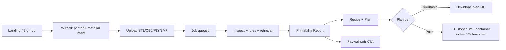

# 05 — Product Requirements (PRD)

**Access date (research):** 2026-08-15  
**Verdict direction:** **VALIDATE FIRST** — não GO de build SaaS completo ainda.  
**Related:** [`06-ux-information-architecture.md`](06-ux-information-architecture.md) · [`07-technical-architecture.md`](07-technical-architecture.md) · [`08-data-api-jobs.md`](08-data-api-jobs.md) · [`09-geometry-rules-ai.md`](09-geometry-rules-ai.md) · [`10-security-privacy-legal.md`](10-security-privacy-legal.md)

---

## 1. Category & positioning

| Campo | Valor | Tipo |
|---|---|---|
| Category | SaaS B2C/B2B-light de **printability & recipe advisory** para FDM | **DECISION** |
| ICP MVP | Hobby + Microfarm (segmento E) | **DECISION** |
| Geography | Brasil first (BRL, Pix) | **DECISION** |
| Differentiator | AI como *premium halo*; motor = rules engine + retrieval | **DECISION** (Approach 2) |
| Knowledge depth day-1 | A1 Mini only (wizard genérico FDM = aspiração) | **FACT** (wiki preenchida só A1 Mini) + **DECISION** |
| Non-category | Não é cloud slicer, não é Bambu cloud, não é marketplace de modelos | **DECISION** |

**One-liner (PT):** “Envie o modelo; receba um relatório de printabilidade, receita citável e plano de impressão — com AI só onde a regra não chega.”

**Assumption:** Microfarm = 1–5 impressoras, dono-operador, sem time de engenharia de processo.

---

## 2. Problem statement

### Jobs-to-be-done

1. **Antes de fatiar:** saber se a peça vai falhar (adesão, overhang, wall thin, volume vs bed).
2. **Escolher receita:** material + perfil + orientação + supports sem trial-and-error caro.
3. **Depois da falha:** diagnosticar com linguagem de maker, não forum-spam.

### Evidence from this repo (local system)

| Capacidade local | Estado | Label |
|---|---|---|
| Wiki `docs/projeto/` (~71 MD) | Operacional | **FACT** |
| `playbook.md` pipeline | Operacional | **FACT** |
| `core/` inspect-mesh / inspect-3mf / repair-mesh light | Operacional | **FACT** |
| Profiles Markdown (não machine-readable ruleset) | Gap para SaaS | **FACT** |
| 3MF = container inspect only (sem rewrite settings Bambu) | Limite | **FACT** |
| SaaS stack (auth, billing, jobs) | Ausente | **FACT** |

**Inference:** O valor SaaS é *productizar* o playbook + wiki + `core/`, não reinventar geometria do zero.

---

## 3. Three strategic options (scored)

Scoring 1–5 (higher = better for VALIDATE-FIRST + bootstrap). Weight: Fit ICP 25%, Time-to-learn 25%, Reuse core/wiki 20%, Legal risk 15%, Revenue path 15%.

### Option A — “Cloud Playbook” (report + recipe + plan MD)

Produto: upload → printability report → recipe + plan Markdown → history. AI chat só em tier pago (failure chat).

| Critério | Score | Nota |
|---|---|---|
| Fit ICP Hobby/Microfarm | 5 | JTBD direto |
| Time-to-learn | 5 | Valida willingness-to-pay sem slicer |
| Reuse core/wiki | 5 | Encaixa no repo |
| Legal risk | 4 | Evita AGPL slicer server-side |
| Revenue path | 3 | Ticket menor; volume necessário |
| **Weighted** | **4.55** | |

### Option B — “Pseudo-slicer” (gerar 3MF/G-code process settings)

Produto: output fatiável plug-and-play (Bambu 3MF settings / G-code).

| Critério | Score | Nota |
|---|---|---|
| Fit ICP | 4 | Alto desejo |
| Time-to-learn | 2 | Longo; muitos edge cases |
| Reuse | 2 | `core/` não escreve settings |
| Legal | 1 | AGPL Studio/Orca se server-side; Bambu proprietary |
| Revenue | 5 | Ticket alto |
| **Weighted** | **2.85** | |

### Option C — “Enterprise API first”

Produto: API de inspeção + rules para farms grandes.

| Critério | Score | Nota |
|---|---|---|
| Fit ICP MVP | 1 | Fora do ICP E |
| Time-to-learn | 2 | Ciclo de venda longo |
| Reuse | 4 | core/ ok |
| Legal | 4 | Similar a A |
| Revenue | 4 | ACV alto, late |
| **Weighted** | **2.55** | |

### Decision

| Item | Valor | Label |
|---|---|---|
| Selected | **Option A** | **DECISION** |
| Deferred | B (3mf *export* limitado como upsell best-effort) | **DECISION** |
| Later | C (Enterprise/API) | **DECISION** |
| Why not B now | Sem ruleset machine-readable; 3MF rewrite = UNKNOWN legal + effort | **INFERENCE** |

---

## 4. MVP user journey



### Journey steps (acceptance-oriented)

1. **Wizard** captura: printer family (day-1: A1 Mini), nozzle (0.4 default), material family, purpose (miniature/tool/decor/vase/other).
2. **Upload** com limites documentados (ver §7 e `10-security-privacy-legal.md`).
3. **Processing** com estados visíveis (`queued|running|succeeded|failed`) — contrato em `08-data-api-jobs.md`.
4. **Report** consumível em < 60s para peça típica Hobby (**ASSUMPTION** de SLO; medir no validate).
5. **Recipe + Plan** com citations para páginas wiki (IDs estáveis).
6. **Upsell** AI failure chat / history / 3mf notes conforme tier.

**Constraint UX:** aspiração “any FDM” no wizard, mas copy deve marcar **knowledge depth = A1 Mini** quando printer ≠ A1 Mini (**DECISION** — honesty over fake coverage).

---

## 5. Printability report contract

Contrato canônico do produto (JSON + UI). Nomes de campos em inglês.

### 5.1 Envelope

```json
{
  "schema_version": "1.0",
  "job_id": "uuid",
  "confidence": { "overall": 0.0, "label": "high|medium|low|unknown" },
  "printer_context": {},
  "mesh_summary": {},
  "findings": [],
  "recipe": {},
  "plan_markdown": "",
  "citations": [],
  "deliverables": {},
  "ai_assist": { "used": false, "mode": "none|halo|failure_chat" }
}
```

### 5.2 Fields (MVP)

| Field | Type | Source | Notes |
|---|---|---|---|
| `mesh_summary.watertight` | bool | `core` MeshReport | **FACT** model exists |
| `mesh_summary.bounds_mm` | [x,y,z] | `core` | units_assumed=mm |
| `mesh_summary.face_count` | int | `core` | |
| `mesh_summary.issues[]` | string | `core` + rules | |
| `findings[].code` | string | rules engine | stable codes e.g. `OVERHANG_RISK` |
| `findings[].severity` | info\|warn\|blocker | rules | |
| `findings[].message_pt` | string | templates | user-facing PT |
| `findings[].evidence` | object | metrics | no free-text invent |
| `recipe.profile_id` | string | profile registry | Markdown-backed day-1 |
| `recipe.material` | string | wizard + rules | |
| `recipe.layer_height_mm` | number\|null | rules | null + `validate_on_printer` |
| `recipe.supports` | enum | rules | tree\|normal\|none\|unknown |
| `recipe.orientation_hint` | string | rules | |
| `citations[].wiki_path` | string | retrieval | required for recipe claims |
| `confidence.overall` | 0–1 | rules | low if printer≠A1 Mini |
| `deliverables.plan_md` | bool | tier | |
| `deliverables.threemf_notes` | bool | tier | inspect notes only MVP |
| `deliverables.history` | bool | tier | |
| `deliverables.failure_chat` | bool | tier | AI premium |

### 5.3 Invariants

1. **Nenhuma setting numérica sem citation ou flag `validate_on_printer`.** (**DECISION**)
2. **LLM não inventa temperatura/flow/speed** — só explica findings já emitidos. (**DECISION**; detalhe em `09-geometry-rules-ai.md`)
3. **3MF deliverable MVP** = notes do inspect (members, has_model, issues), não rewrite de process settings. (**FACT** + **DECISION**)

### 5.4 Example finding

```json
{
  "code": "BED_VOLUME_EXCEEDED",
  "severity": "blocker",
  "message_pt": "A peça excede o volume útil da A1 Mini na orientação atual.",
  "evidence": { "size_xyz_mm": [220, 40, 40], "bed_mm": [180, 180, 180] },
  "suggested_actions": ["rotate_z", "split_model", "scale_down"]
}
```

---

## 6. Scope: Now / Next / Later / Never

### Now (VALIDATE window — prototypes, not full SaaS)

- Landing + waitlist + 5–10 interviews Hobby/Microfarm (**DECISION**)
- Manual/concierge: founder roda playbook + `core/` e entrega report PDF/MD
- Instrumentar: tempo, findings úteis, willingness-to-pay ranges (**não inventar TAM**)
- Extrair 10–20 rules machine-checkable a partir dos MD profiles (**HYPOTHESIS**: suficiente para demo)

### Next (MVP paid, se validate passar)

- Auth + billing BR (Pix) — ver `07-technical-architecture.md`
- Job pipeline: upload → inspect → rules → report
- Tiers: recipe+plan / +3mf notes / +history / +failure chat
- A1 Mini + PLA/PETG paths
- Confidence UX + paywall moments (`06-ux-information-architecture.md`)

### Later

- Wizard “any FDM” com knowledge packs por printer
- Machine-readable profile pack v2
- Best-effort 3MF *export* (ainda não Studio rewrite)
- Enterprise/API (Option C)
- Multi-material AMS workflows avançados
- Failure chat multimodal (foto da falha)

### Never (product doctrine)

- Hosted Bambu Studio / OrcaSlicer fatiando server-side (**AGPL + ops**) — **DECISION**
- Bambu cloud integration no MVP — **DECISION**
- Guarantees de “primeira impressão perfeita”
- Remodelagem CAD pesada / generative design
- Marketplace de STLs / social feed
- Auto-buy filament / hardware lock-in

---

## 7. Plans & deliverables matrix

| Deliverable | Free / Validate | Starter | Pro (AI halo) | Notes |
|---|---|---|---|---|
| Printability report (basic) | ✓ limited/mo | ✓ | ✓ | **DECISION** quotas TBD pós-validate |
| Recipe + plan MD | ✓ watermarked | ✓ | ✓ | |
| Citations | ✓ | ✓ | ✓ | |
| 3MF inspect notes | — | ✓ | ✓ | not settings rewrite |
| Job history | — | ✓ | ✓ | |
| Failure chat (AI) | — | — | ✓ | premium differentiator |
| Priority queue | — | — | ✓ | **ASSUMPTION** |

Quotas numéricas exatas: **UNKNOWN** até pricing tests (ver validate).

---

## 8. MVP user stories + acceptance criteria

### US-01 — Wizard honest

**As a** hobbyist, **I want** to declare printer/material/purpose, **so that** recommendations match my setup.

**Acceptance**
- Given A1 Mini + PLA + miniature, when I finish wizard, then `printer_context` stores those values.
- Given non–A1 Mini, when report renders, then confidence ≤ medium and banner “knowledge depth limitada” appears.
- Wizard never claims full support for unfilled printers.

### US-02 — Upload & inspect

**As a** user, **I want** to upload STL/OBJ/PLY/3MF, **so that** I get mesh facts.

**Acceptance**
- Accepted suffixes match `core` (`MESH_SUFFIXES` + `.3mf`).
- File > `MAX_FILE_BYTES` (500 MiB) rejected with clear error (**FACT** cap in `core/paths.py`).
- Empty file rejected.
- Job reaches `succeeded` with `mesh_summary` populated OR `failed` with typed error (no silent hang).

### US-03 — Printability findings

**As a** microfarm operator, **I want** blocker/warn/info findings, **so that** I prioritize fixes.

**Acceptance**
- At least codes: `NON_WATERTIGHT`, `BED_VOLUME_EXCEEDED`, `THIN_WALL_RISK` (heuristic MVP), `OVERHANG_RISK` (heuristic), `CAPABILITY_GATE_MATERIAL`.
- Each finding has `code`, `severity`, `message_pt`, `evidence`.
- Blockers prevent “ready to print” badge.

### US-04 — Recipe + plan with citations

**As a** user, **I want** a recipe tied to wiki citations, **so that** I trust and reproduce in Studio.

**Acceptance**
- `recipe.profile_id` maps to an existing A1 Mini profile page when printer=A1 Mini.
- `citations.length >= 1` for any numeric process suggestion.
- Uncertain numbers marked `validate_on_printer: true`.
- Plan Markdown includes orientation, supports, brim/raft hint, material, profile.

### US-05 — Tiered deliverables

**As a** Pro subscriber, **I want** history + failure chat, **so that** I iterate after a fail.

**Acceptance**
- Starter cannot open failure chat (402/upgrade CTA).
- Pro can start chat bound to `job_id` + findings only (no raw setting hallucination — `09`).
- History lists last N jobs with status and report link.

### US-06 — 3MF notes (not fake slicer)

**As a** user with `.3mf`, **I want** container inspection notes, **so that** I know if a model payload exists.

**Acceptance**
- Output mirrors `ThreeMfReport` fields (is_zip, members, has_model, issues).
- UI copy states: “não reescrevemos process settings Bambu no MVP”.

### US-07 — Soft paywall

**As a** free user, **I want** to see value before pay, **so that** conversion is informed.

**Acceptance**
- Free sees report summary + 1 full recipe/month (**ASSUMPTION** — tune in validate).
- Paywall moments follow `06-ux-information-architecture.md` (after first “aha”, not before upload).

### US-08 — LGPD basics

**As a** Brazilian user, **I want** to delete my account/files, **so that** I control my data.

**Acceptance**
- Delete account enqueues purge of uploads + reports within documented SLA (**ASSUMPTION** 72h).
- Privacy policy link in signup. Counsel flags in `10-security-privacy-legal.md`.

---

## 9. Non-functional requirements (MVP)

| NFR | Target | Label |
|---|---|---|
| Locale | PT-BR UI; EN field names in API | **DECISION** |
| Currency | BRL + Pix | **DECISION** |
| Availability | Best-effort single region | **ASSUMPTION** |
| Max upload | ≤ 500 MiB hard; product may set lower soft cap | **FACT** + **DECISION** |
| PII | Minimize; no model training opt-out default = no train | **DECISION** pending counsel |
| Observability | Job metrics + error codes | **DECISION** |

---

## 10. Validation plan (before GO)

| # | Test | Pass signal | Fail signal |
|---|---|---|---|
| V1 | 8–12 interviews ICP E | ≥6 descrevem dor de falha/receita | “já resolvo no YouTube/Studio” dominante |
| V2 | Concierge 10 jobs | ≥7 pagariam R$X (X medido, não inventado) | Só usariam se grátis |
| V3 | Time-to-report | p50 < 2 min peça <50MB | >10 min ou crashes |
| V4 | Citation trust | Users verify ≥1 citation as useful | “parece ChatGPT genérico” |
| V5 | Legal skim | Counsel: path Option A ok com mitigations | Blockers AGPL/CC/Bambu |

**GO criteria:** V1+V2+V5 pass; V3/V4 no critical fail.  
**Goal R$40k+ MRR / 12 months:** **HYPOTHESIS** agressiva — não é critério de VALIDATE; é aspiraçāo pós-PMF.

---

## 11. Open questions

| ID | Question | Status |
|---|---|---|
| Q1 | Soft upload cap (ex. 50–100 MiB) vs 500 MiB? | **UNKNOWN** |
| Q2 | Free quota exacta | **UNKNOWN** |
| Q3 | Brand name / domain | **UNKNOWN** |
| Q4 | Profile MD → YAML/JSON schema owner | **DECISION** needed at Next |
| Q5 | Photo-based failure chat timeline | Later |

---

## 12. Traceability

| Requirement | Downstream doc |
|---|---|
| Journey / paywall | `06-ux-information-architecture.md` |
| Modular monolith | `07-technical-architecture.md` |
| Job + API | `08-data-api-jobs.md` |
| Rules + AI halo | `09-geometry-rules-ai.md` |
| Upload hostile / LGPD / licenses | `10-security-privacy-legal.md` |
