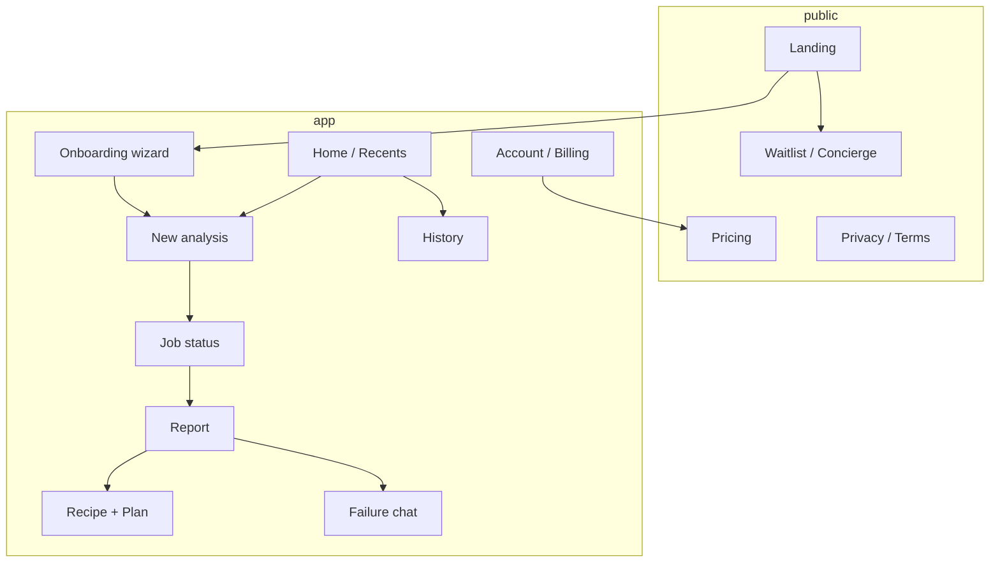
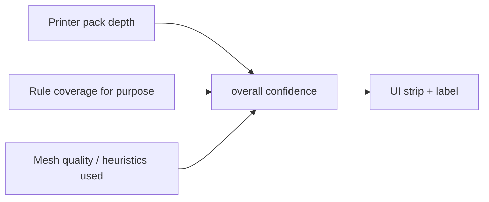
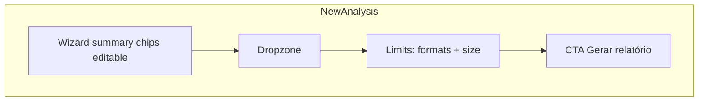
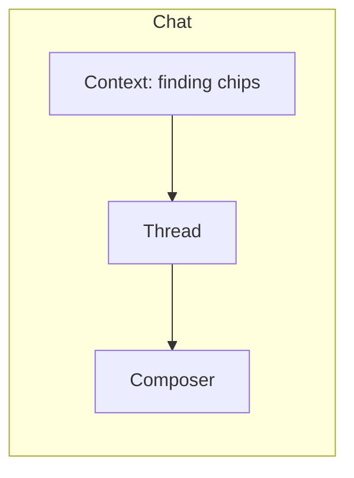

# 06 — UX & Information Architecture

**Access date:** 2026-08-15  
**Product stance:** VALIDATE FIRST · Option A (Cloud Playbook) · AI = premium halo  
**Related:** [`05-product-requirements.md`](05-product-requirements.md) · [`07-technical-architecture.md`](07-technical-architecture.md) · [`08-data-api-jobs.md`](08-data-api-jobs.md) · [`09-geometry-rules-ai.md`](09-geometry-rules-ai.md) · [`10-security-privacy-legal.md`](10-security-privacy-legal.md)

---

## 1. Design principles (premium, not “AI purple”)

| # | Principle | Rationale | Label |
|---|---|---|---|
| P1 | **Workshop clarity** | Maker trust > sci-fi dashboard | **DECISION** |
| P2 | **One job per screen** | Upload → wait → report → act | **DECISION** |
| P3 | **Confidence is UI** | Low knowledge depth must be visible | **DECISION** |
| P4 | **Cite before charm** | Every recipe number shows source or “validate on printer” | **DECISION** |
| P5 | **AI is a tool shelf, not the hero** | Rules own truth; chat explains | **DECISION** (Approach 2) |
| P6 | **Honest coverage** | Wizard may list FDM families; depth badge = A1 Mini | **DECISION** |
| P7 | **Pay after aha** | Never block first inspect behind hard paywall | **DECISION** |
| P8 | **PT-BR voice** | Técnica em EN (`watertight`, `3MF`, `job_id`) | **DECISION** |

**Visual direction (when UI exists):** industrial-clean — deep charcoal/ink, single accent (amber or teal), typography with character (not Inter default). Avoid purple-glow AI cliché. (**DECISION** aesthetic; validate with ICP photos of real desks.)

**Anti-patterns:** fake “100% print success” meters; animated robots; card spam in hero; overlay badges on 3D preview.

---

## 2. Information architecture



### Nav (logged-in)

| Item | Route (proposal) | Tier gate |
|---|---|---|
| Início | `/app` | all |
| Nova análise | `/app/new` | all (quota) |
| Histórico | `/app/history` | Starter+ |
| Conta | `/app/account` | all |
| Upgrade | `/app/upgrade` | free |

**Inference:** Microfarm users think in “última peça que falhou”, not “projects/folders” — history > nested workspaces no MVP.

---

## 3. Screen inventory & states

### 3.1 Landing (public)

**Purpose:** explicar categoria + CTA validate/waitlist.  
**Hero budget:** marca + 1 headline + 1 frase + CTA + 1 visual de report (não collage).  
**States:** default · geo-BR Pix mention · VALIDATE banner (“em validação — vagas concierge”).

### 3.2 Onboarding wizard

Steps:

1. Printer family (A1 Mini highlighted; others = “cobertura limitada”)
2. Nozzle (0.4 default)
3. Material family (PLA/PETG day-1; others capability-gated)
4. Purpose (miniatura / ferramenta / decorativa / vaso / outro)

| State | UI |
|---|---|
| empty | CTAs disabled until step 1+2 |
| partial | progress 1–4 |
| complete | “Continuar para upload” |
| edit later | accessible from Account / New analysis |

### 3.3 Upload (`/app/new`)

| State | Behavior |
|---|---|
| idle | dropzone STL/OBJ/PLY/3MF |
| dragging | highlight |
| validating | client: extension + size soft-cap |
| uploading | progress % |
| queued | link to job |
| error_type | typed messages (too large, empty, unsupported) |
| quota_exceeded | soft paywall |

**Copy FACT:** hard cap técnico 500 MiB no `core`; produto pode soft-cap menor (**UNKNOWN** value).

### 3.4 Job status

Map to machine in `08-data-api-jobs.md`:

| Job state | User label PT | Chrome |
|---|---|---|
| `queued` | Na fila | skeleton |
| `running` | Analisando malha e regras | indeterminate + tips |
| `succeeded` | Pronto | auto-redirect report |
| `failed` | Falha na análise | retry + código |
| `canceled` | Cancelado | back to new |

**SLA copy:** “Peças típicas: cerca de 1–2 minutos” = **ASSUMPTION** — ajustar com métricas.

### 3.5 Printability report

Layout (single column mobile-first):

1. **Confidence strip** (overall + depth badge)
2. **Verdict chip:** Pronto com ressalvas | Ajustes necessários | Bloqueadores
3. **Findings list** (blockers first)
4. **Mesh facts** (watertight, bounds, faces)
5. CTA: Ver receita · Abrir chat (Pro) · Baixar plano

| State | Notes |
|---|---|
| loading | rare if redirected after succeed |
| partial | if recipe still compiling — avoid; atomic succeed |
| empty findings | “Nenhum bloqueador automático; revise receita” |
| low confidence | amber strip + explain why |

### 3.6 Recipe + Plan

- Profile ID + material + orientation + supports + brim hint
- Markdown plan render + Download `.md`
- Citations panel (wiki paths humanized)
- Numbers with `validate_on_printer` → dashed badge

### 3.7 History

- Table/list: date, filename, verdict, confidence, open
- Empty: CTA nova análise
- Free: locked teaser with 1 ghost row (**DECISION**)

### 3.8 Failure chat (Pro)

- Context chips: job findings codes (read-only)
- Input: “O que aconteceu na impressão?”
- Answers must reference finding codes / citations
- State `thinking` · `answered` · `refused` (off-topic / ask for setting invent)

### 3.9 Account / Billing

- Plan, Pix invoices status, delete account, export data request
- Link privacy (`10`)

---

## 4. Confidence UX (critical)



| Signal | UI treatment |
|---|---|
| Printer = A1 Mini + PLA/PETG + known purpose | green / high |
| Printer = A1 Mini + gated material (ABS…) | medium + capability gate callout |
| Printer ≠ A1 Mini | low/medium + “wizard genérico; depth A1 Mini” |
| Heuristic-only overhang/thin wall | medium + “estimativa” |
| LLM explanation | never increases confidence score |

**DECISION:** Confidence is computed by rules layer only (`09`), not by the LLM.

### Microcopy examples (PT)

- Alta: “Cobertura profunda para A1 Mini neste material.”
- Média: “Regras parciais — valide no fatiador/impressora.”
- Baixa: “Impressora fora do knowledge pack atual; trate como checklist genérico.”

---

## 5. Paywall moments

| Moment | Trigger | Pattern | Label |
|---|---|---|---|
| M0 | Landing | Soft — waitlist / concierge | VALIDATE |
| M1 | After first full report | “Salvar histórico” blur | **DECISION** |
| M2 | 3MF notes request on Free | Modal Starter | **DECISION** |
| M3 | Failure chat click | Modal Pro (AI halo) | **DECISION** |
| M4 | Quota exceeded | Full-screen upgrade | **DECISION** |
| M5 | Download plan watermark remove | Optional Starter | **ASSUMPTION** |

**Rules**

1. Never paywall the *existence* of blockers on first job.
2. AI chat never appears as free trial that hallucinates settings — if trial, same no-hallucination policy.
3. Pricing page shows Pix + BRL prominently.

---

## 6. Mobile strategy

| Topic | MVP choice | Label |
|---|---|---|
| Primary | Responsive web (mobile-friendly) | **DECISION** |
| Upload | OS file picker; warn large files on cellular | **DECISION** |
| 3D preview | Optional later; MVP = bounds + icons | **DECISION** |
| Native app | Never in MVP | **DECISION** |
| Thumb reach | Primary CTAs bottom sheet on small screens | **DECISION** |

**Inference:** Microfarm users often operate phone beside printer for failure chat later — design chat mobile-first even if upload is desktop-heavy.

---

## 7. Content & empty states

| Screen | Empty / first-run copy focus |
|---|---|
| Home | “Analise sua primeira peça — comece pelo A1 Mini + PLA” |
| History | “Assine Starter para guardar corridas” |
| Chat | “Descreva a falha; eu uso os findings do job, sem inventar temperatura” |
| Report no blockers | Still show recipe; avoid celebratory confetti |

---

## 8. Wireframes (Mermaid — structural)

### 8.1 Report wireframe

```mermaid
flowchart TB
  subgraph ReportPage
    H[Header: arquivo + data + tier badge]
    C[Confidence strip]
    V[Verdict chip]
    F[Findings: blockers / warns / info]
    M[Mesh summary facts]
    A[Actions: Receita | Plano | Chat?]
  end
  H --> C --> V --> F --> M --> A
```

### 8.2 New analysis wireframe



### 8.3 Failure chat wireframe



---

## 9. Accessibility & inclusion

| Item | MVP bar |
|---|---|
| Contrast | WCAG AA for text on report |
| Findings | Not color-only — icons + text severity |
| Keyboard | Wizard + upload button operable |
| Language | Avoid English-only error strings in UI |

---

## 10. Metrics (UX)

| Metric | Why | Label |
|---|---|---|
| Time-to-first-report | Activation | **DECISION** track |
| % jobs with ≥1 citation click | Trust | **DECISION** |
| Paywall view → checkout start | M1–M4 | **DECISION** |
| Chat refusal rate | Safety of AI halo | **DECISION** |
| “Low confidence” bounce | Honesty vs churn | **HYPOTHESIS** monitor |

**Do not invent conversion benchmarks** — measure in validate.

---

## 11. Concierge UX (VALIDATE NOW)

Before full app:

1. Form: printer, material, purpose, file link/upload
2. Founder delivers PDF/MD report using same contract (`05` §5)
3. Interview script: o que surpreendeu / o que pagaria / o que faltou
4. Visual mock of report screen (Figma optional) shown in call

**DECISION:** Concierge copy must match future product honesty (A1 Mini depth).

---

## 12. Open UX questions

| ID | Question | Status |
|---|---|---|
| U1 | Soft size cap messaging | **UNKNOWN** |
| U2 | Watermark style on free plan MD | **UNKNOWN** |
| U3 | Show face_count to novices? | **ASSUMPTION** yes, collapsible |
| U4 | Dark/light default | **DECISION** prefer light workshop day / dark optional later |

---

## 13. Acceptance checklist (UX)

- [ ] Confidence strip present on every report
- [ ] Non–A1 Mini path shows limited-depth banner
- [ ] Paywall never blocks first blocker list
- [ ] Failure chat gated + no setting invention copy
- [ ] Pix/BRL visible on pricing
- [ ] Mobile: upload + report readable without horizontal scroll
- [ ] Citations one-tap from recipe numbers
