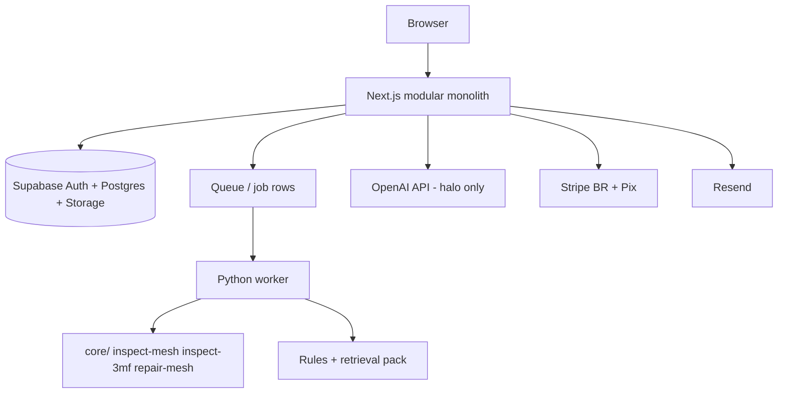
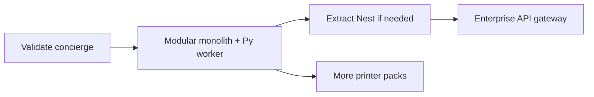

# 07 — Technical Architecture

**Access date:** 2026-08-15  
**Recommendation:** **Modular monolith** (Next.js app + embedded API routes or thin Nest later + **Python worker** reusing `core/`)  
**Related:** [`05-product-requirements.md`](05-product-requirements.md) · [`06-ux-information-architecture.md`](06-ux-information-architecture.md) · [`08-data-api-jobs.md`](08-data-api-jobs.md) · [`09-geometry-rules-ai.md`](09-geometry-rules-ai.md) · [`10-security-privacy-legal.md`](10-security-privacy-legal.md)

---

## 1. Context & constraints

| Constraint | Detail | Label |
|---|---|---|
| Team | Founder solo + Cursor/ChatGPT; occasional contractor | **FACT** (founder decision) |
| Goal | R$40k+ MRR / 12 months | **HYPOTHESIS** agressiva |
| Verdict | VALIDATE FIRST — architecture for cheap learning | **DECISION** |
| Reuse | `core/` Python CLI (trimesh inspect, 3mf zip RO, repair light) | **FACT** |
| No SaaS stack in repo today | auth/billing/jobs absent | **FACT** |
| Brazil | BRL, Pix | **DECISION** |
| AI | Halo only; rules authoritative | **DECISION** |

---

## 2. ADR — runtime topology

### Options compared

| ID | Topology | Summary |
|---|---|---|
| T1 | **Next-only** | Next.js (App Router) + serverless functions + WASM/port of mesh logic |
| T2 | **Next + Nest + Python worker** | Next UI, Nest API, separate Python worker/queue |
| T3 | **SOA early** | Many services (upload, mesh, rules, AI, billing) |

### Scores (1–5) for bootstrap VALIDATE→MVP

| Criterion (weight) | T1 Next-only | T2 Next+Nest+Py | T3 SOA |
|---|---|---|---|
| Reuse `core/` (25%) | 1 | 5 | 5 |
| Solo operability (25%) | 4 | 3 | 1 |
| Mesh CPU fitness (20%) | 2 | 5 | 5 |
| Time-to-MVP (15%) | 4 | 3 | 1 |
| Future split cost (15%) | 2 | 4 | 5 |
| **Weighted** | **2.55** | **4.05** | **3.20** |

### Analysis

**T1 — Next-only**  
- Pros: one deploy, Vercel ergonomics.  
- Cons: portar `trimesh` para JS/WASM = rewrite; 500 MiB uploads poor fit for serverless timeouts/memory; duplicates domain already in `core/models.py`.  
- **Reject for mesh path.** Possible later for static marketing only.

**T2 — Next + Nest + Python worker**  
- Pros: clear UI/API/worker; Nest useful if contractor joins; Python keeps `core/`.  
- Cons: 3 moving parts early; more DevOps for solo.  
- **Viable**, but Nest can be deferred.

**T3 — SOA**  
- Pros: scale limits independent.  
- Cons: premature for ICP Hobby; observability tax kills solo founder.  
- **Reject until** Enterprise/API (Later in `05`).

### Decision — Modular monolith (T2-lite)

| Choice | Detail | Label |
|---|---|---|
| **Adopt** | Single deployable **app** (Next.js) + **one Python worker** process sharing DB/queue | **DECISION** |
| Nest | Optional extract when API surface > ~15 routes or second consumer | **DECISION** |
| Modules | `billing`, `jobs`, `reports`, `identity`, `ai_gateway` as folders/packages — not networks | **DECISION** |
| `core/` | Installed as library/CLI invoked by worker (`python -m core …` or import adapters) | **DECISION** |

**ADR status:** Accepted for MVP planning; revisit if validate fails or Enterprise arrives.

---

## 3. Module map (modular monolith)

| Module | Responsibility | Talks to |
|---|---|---|
| `web` | UI PT-BR, wizard, report | API routes |
| `identity` | session, LGPD delete hooks | Supabase Auth |
| `uploads` | signed URLs, virus gate hooks | Storage |
| `jobs` | state machine | DB + worker |
| `geometry` | wrap `core/` reports | worker |
| `rules` | deterministic findings + recipe | wiki pack |
| `ai_gateway` | failure chat, explanations | OpenAI |
| `billing` | Stripe/Pix, entitlements | Stripe |
| `citations` | map profile → wiki paths | static pack |

Dependency rule: `ai_gateway` **reads** findings; never writes recipe numbers. (`09`)

---

## 4. Reuse of `core/`

| Capability | Repo today | SaaS use |
|---|---|---|
| `inspect-mesh` | trimesh → `MeshReport` | worker step |
| `inspect-3mf` | zip RO → `ThreeMfReport` | worker step |
| `repair-mesh` | light ops | optional Next/Later; gate carefully |
| `validate-wiki` | CI for docs | CI for knowledge pack |
| `MAX_FILE_BYTES=500MiB` | hard cap | enforce again at upload edge |
| Magic-byte validation | **absent** | **must add** at edge (`10`) | **FACT** gap |

**DECISION:** Do not rewrite mesh math in TypeScript for MVP.  
**DECISION:** Worker runs in environment with enough RAM/disk for worst soft-cap file.

---

## 5. Deployment topology (MVP)

| Piece | Suggested | Label |
|---|---|---|
| Web/API | Vercel or single Fly/Render web service | **ASSUMPTION** — pick at build |
| Worker | Fly.io / Render / Railway long-running | **ASSUMPTION** |
| DB/Auth/Storage | Supabase | **DECISION** lean |
| Secrets | hosted secret store | **DECISION** |
| Region | South America if available; else US-east + latency accept | **UNKNOWN** optimal |

**Validate phase:** no always-on worker — founder laptop/`core/` concierge.

---

## 6. Build vs buy

| Need | Buy | Build | Rationale |
|---|---|---|---|
| Auth | Supabase Auth | — | speed |
| Postgres | Supabase | — | |
| Object storage | Supabase Storage / S3 | — | |
| Payments BR | Stripe (BRL + Pix) | — | **DECISION** |
| Email | Resend | — | |
| Mesh inspect | — | reuse `core/` | **FACT** asset |
| Rules engine | — | thin Python/TS | domain IP |
| Wiki retrieval | — | embed + citation index | |
| LLM | OpenAI API | — | halo only |
| Full slicer | — | **Never host** | AGPL (`10`) |
| Support desk | — | email MVP | bootstrap |

---

## 7. Infra cost stages (secondary sources; 2026-08-15)

> **Nota de pesquisa:** páginas oficiais de pricing em parte **timeout** nesta data; valores abaixo são de **fontes secundárias / memória de mercado comum** e devem ser **revalidação em site oficial** antes de GO. Não usar como forecast de P&L.

| Service | Stage 0 Validate | Stage 1 MVP | Cited ballpark | Label |
|---|---|---|---|---|
| Supabase | Free → Pro when needed | **Pro ~US$25/mo** | secondary | **ASSUMPTION** confirm |
| Stripe BR cards | — | **3.99% + R$0.39** / success | secondary | **ASSUMPTION** confirm |
| Stripe Pix | — | **1.19%** | secondary | **ASSUMPTION** confirm |
| Resend | Free | **Free 3k emails/mo** then paid | secondary | **ASSUMPTION** confirm |
| OpenAI `gpt-4o-mini` | rare | **~$0.15 / $0.60 per 1M** in/out tokens | secondary; **official page timed out 2026-08-15** | **ASSUMPTION** |
| Compute web+worker | $0 concierge | ~US$10–40/mo small VMs | **HYPOTHESIS** | |
| Domain/DNS | low | low | — | |

**Cost control:** route AI only on Pro chat + optional explanation button (`09` cost routing).  
**Inference:** At Hobby ARPU, AI must stay halo or margin dies.

---

## 8. Security architecture (summary)

Details in `10-security-privacy-legal.md`.

| Control | MVP |
|---|---|
| Signed upload URLs | yes |
| Worker isolation | separate process/user; no shell on filenames |
| ClamAV or equivalent | strongly recommended before mesh parse |
| Rate limits | per IP + per user |
| Entitlements checked server-side | yes |

---

## 9. Knowledge pack packaging

Profiles today = Markdown (**FACT**). For SaaS:

| Artifact | Owner | Format target |
|---|---|---|
| Wiki snapshot | repo `docs/projeto` | versioned pack `knowledge_pack@semver` |
| Rules YAML/JSON | new | derived from MD — human still edits MD first |
| Embeddings | build pipeline | optional for retrieval |
| Printer packs | `docs/printers` | A1 Mini only filled |

**DECISION:** Ship pack version in every report (`knowledge_pack_version`).

---

## 10. Observability

| Signal | Tooling lean |
|---|---|
| Job duration / fail codes | Postgres metrics + log drain |
| Upload rejects | counters |
| AI token spend | ai_gateway meter |
| Stripe webhooks | idempotent table |

No Datadog required day-1 (**ASSUMPTION**).

---

## 11. Evolution path

Never jump V→SOA.

---

## 12. Risks & mitigations

| Risk | Mitigation |
|---|---|
| Serverless timeout on mesh | dedicated worker |
| Solo bus factor | modular folders + docs ADRs |
| AGPL contamination | no Studio/Orca server | **DECISION** |
| Cost OpenAI | Pro-only + mini model + caps |
| 500 MiB abuse | soft cap + auth + virus scan |
| Nest premature | delay until pain |

---

## 13. Acceptance (architecture)

- [ ] Worker invokes same semantics as `MeshReport` / `ThreeMfReport`
- [ ] No TypeScript reimplementation of trimesh for MVP
- [ ] Modules compile independently enough for contractor PR
- [ ] Billing entitlements enforced outside UI
- [ ] Official pricing re-checked before GO (Supabase/Stripe/OpenAI/Resend)
- [ ] Region + backup policy documented

---

## 14. Open technical questions

| ID | Question | Status |
|---|---|---|
| T1 | Vercel vs Fly for web | **UNKNOWN** |
| T2 | Queue = Supabase + SKIP LOCKED vs Redis | **ASSUMPTION** start with DB jobs |
| T3 | Soft upload cap MiB | **UNKNOWN** |
| T4 | When to introduce Nest | trigger rules above |
