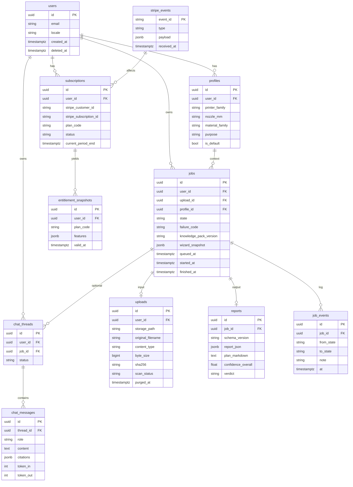
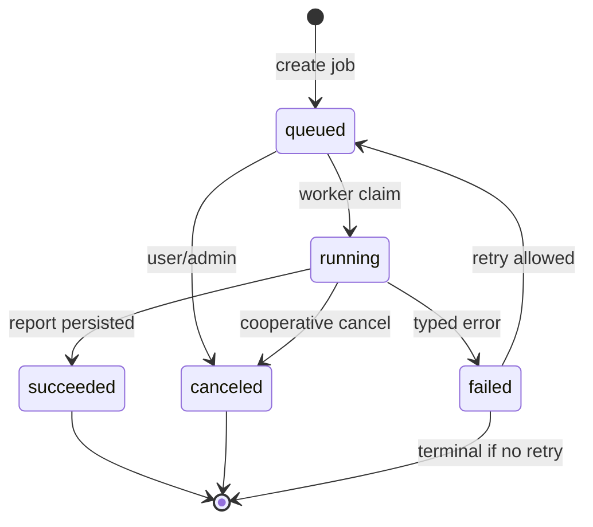

# 08 — Data Model, API & Jobs

**Access date:** 2026-08-15  
**Related:** [`05-product-requirements.md`](05-product-requirements.md) · [`06-ux-information-architecture.md`](06-ux-information-architecture.md) · [`07-technical-architecture.md`](07-technical-architecture.md) · [`09-geometry-rules-ai.md`](09-geometry-rules-ai.md) · [`10-security-privacy-legal.md`](10-security-privacy-legal.md)

---

## 1. Principles

| Principle | Detail | Label |
|---|---|---|
| Job-centric | Every analysis is a `jobs` row with immutable inputs | **DECISION** |
| Report as artifact | Store JSON contract (`05` §5) + optional MD | **DECISION** |
| Entitlements server-side | Tier gates on read/write of deliverables | **DECISION** |
| Soft delete | Uploads marked deleted → worker purge | **DECISION** |
| Idempotent billing | Stripe webhook event IDs unique | **DECISION** |
| No training flag default | `allow_training=false` | **DECISION** pending counsel (`10`) |

---

## 2. ERD (Mermaid)



---

## 3. Entity dictionary

### users
Identity from Supabase Auth; app table mirrors `auth.users.id`.  
**LGPD:** `deleted_at` starts purge pipeline.

### profiles (wizard)
Mutable preferences; jobs store `wizard_snapshot` for reproducibility (**DECISION**).

### uploads
| Column | Notes |
|---|---|
| `scan_status` | `pending\|clean\|infected\|error` |
| `sha256` | dedupe / abuse detection |
| `original_filename` | display only; never path concat |

### jobs
State machine §4. `knowledge_pack_version` required on success.

### reports
`report_json` must validate against schema_version.  
`verdict` enum: `ready_with_caveats|needs_fixes|blocked|unknown`.

### chat_*
Pro only. Messages store token meters for cost routing (`09`).

### subscriptions / entitlements
`plan_code`: `free|starter|pro`.  
Features JSON example:

```json
{
  "history": true,
  "threemf_notes": true,
  "failure_chat": false,
  "jobs_per_month": 20
}
```

---

## 4. Job state machine



### Transitions

| From | To | Actor | Guard |
|---|---|---|---|
| — | `queued` | API | upload `scan_status=clean` (or validate-phase bypass documented) |
| `queued` | `running` | worker | lease/lock |
| `running` | `succeeded` | worker | report JSON valid |
| `running` | `failed` | worker | `failure_code` set |
| `queued`/`running` | `canceled` | user | before succeed |
| `failed` | `queued` | user | retry_count < max |

### failure_code (MVP)

| Code | Meaning |
|---|---|
| `UPLOAD_MISSING` | storage object gone |
| `UNSUPPORTED_FORMAT` | suffix/MIME |
| `FILE_TOO_LARGE` | over cap |
| `MESH_PARSE_ERROR` | trimesh failed |
| `THREEMF_NOT_ZIP` | inspect-3mf |
| `RULES_ERROR` | pack broken |
| `INTERNAL` | unexpected |
| `SCAN_INFECTED` | malware |

**DECISION:** User-facing PT messages mapped from codes; never leak stack traces.

### Worker steps (ordered)

1. Claim job + set `started_at`
2. Download upload to scratch
3. Extension/MIME/magic checks (`10`)
4. `inspect-mesh` or `inspect-3mf`
5. Optional light repair (**feature flag**, default off in MVP SaaS)
6. Rules + retrieval → findings + recipe
7. Persist `reports` + `succeeded`
8. Wipe scratch

---

## 5. API contracts outline

Base: `/api/v1` · Auth: Bearer session JWT · Errors: `{ "error": { "code", "message_pt" } }`

### 5.1 Profiles

| Method | Path | Notes |
|---|---|---|
| GET | `/profiles` | list |
| POST | `/profiles` | create wizard profile |
| PATCH | `/profiles/:id` | update |
| POST | `/profiles/:id/default` | set default |

### 5.2 Uploads

| Method | Path | Notes |
|---|---|---|
| POST | `/uploads/sign` | body: filename, size, content_type → signed URL |
| POST | `/uploads/:id/complete` | confirm + enqueue scan |

**Reject** if size > product soft-cap or `MAX_FILE_BYTES`.

### 5.3 Jobs

| Method | Path | Notes |
|---|---|---|
| POST | `/jobs` | `{ upload_id, profile_id }` → `{ job_id, state }` |
| GET | `/jobs/:id` | status + timestamps |
| GET | `/jobs` | history (Starter+); Free = 402 or last-1 policy |
| POST | `/jobs/:id/cancel` | |
| POST | `/jobs/:id/retry` | |

### 5.4 Reports

| Method | Path | Notes |
|---|---|---|
| GET | `/jobs/:id/report` | full JSON if entitled |
| GET | `/jobs/:id/plan.md` | markdown download; watermark if free |

Entitlement examples:

- Free: report summary fields only OR full on first N (**ASSUMPTION** — product sets)
- Starter: + `deliverables.threemf_notes` + history
- Pro: + failure chat

### 5.5 Chat

| Method | Path | Notes |
|---|---|---|
| POST | `/jobs/:id/chat/threads` | Pro; 402 otherwise |
| POST | `/chat/threads/:id/messages` | streams optional later |
| GET | `/chat/threads/:id` | |

Request message body cannot ask worker to change recipe silently — chat is advisory (`09`).

### 5.6 Billing

| Method | Path | Notes |
|---|---|---|
| POST | `/billing/checkout` | plan_code → Stripe Checkout (Pix/card) |
| POST | `/billing/portal` | customer portal |
| POST | `/webhooks/stripe` | raw body verify signature |

### 5.7 Account / LGPD

| Method | Path | Notes |
|---|---|---|
| POST | `/account/export` | enqueue export |
| DELETE | `/account` | soft delete + purge jobs |

---

## 6. Example payloads

### POST `/jobs`

```json
{
  "upload_id": "11111111-1111-1111-1111-111111111111",
  "profile_id": "22222222-2222-2222-2222-222222222222"
}
```

### GET `/jobs/:id` (running)

```json
{
  "id": "33333333-3333-3333-3333-333333333333",
  "state": "running",
  "queued_at": "2026-08-15T12:00:00Z",
  "started_at": "2026-08-15T12:00:05Z",
  "finished_at": null,
  "failure_code": null
}
```

### Report fragment

Aligned to `05` §5 — worker must not emit numeric `recipe` fields without `citations` or `validate_on_printer`.

---

## 7. Quotas & rate limits

| Limit | Default proposal | Label |
|---|---|---|
| Sign upload / IP / hour | 30 | **ASSUMPTION** |
| Jobs / free / month | TBD validate | **UNKNOWN** |
| Chat messages / Pro / day | 50 | **ASSUMPTION** |
| Max concurrent jobs / user | 1–2 | **DECISION** |

Enforce in API + billing features JSON.

---

## 8. Retention

| Artifact | Retention | Label |
|---|---|---|
| uploads | until user delete or N days inactive | **ASSUMPTION** 90d |
| reports | same as history entitlement | |
| chat | with job or 90d | **ASSUMPTION** |
| stripe_events | 1+ year | **ASSUMPTION** counsel |
| scratch disk | delete immediately post-job | **DECISION** |

---

## 9. Indexes (MVP)

- `jobs(user_id, created_at desc)`
- `jobs(state, queued_at)` partial where `state='queued'`
- `uploads(sha256)`
- `subscriptions(stripe_customer_id)`
- `stripe_events(event_id)` PK

---

## 10. Test scenarios (data/API)

| ID | Scenario | Expect |
|---|---|---|
| D1 | Complete job happy path STL | `succeeded` + report schema |
| D2 | 3MF non-zip | `failed` `THREEMF_NOT_ZIP` |
| D3 | Free user history list | empty/402 per policy |
| D4 | Pro chat without job findings | still allowed but model constrained |
| D5 | Stripe duplicate webhook | idempotent no double entitle |
| D6 | Delete account | uploads purged; jobs anonymized/deleted |
| D7 | Retry after `MESH_PARSE_ERROR` | new attempt / same upload |

---

## 11. Concierge mapping (VALIDATE)

| Concierge artifact | Future table |
|---|---|
| Google Form row | `jobs` + `profiles` |
| Drive file | `uploads` |
| Delivered MD/PDF | `reports.plan_markdown` / PDF export Later |
| Payment PIX manual | `subscriptions` manual flag |

---

## 12. Open data questions

| ID | Question | Status |
|---|---|---|
| A1 | Soft-delete vs hard-delete reports on downgrade | **UNKNOWN** |
| A2 | Dedup same sha256 across users | privacy vs cost — **ASSUMPTION** no cross-user dedup |
| A3 | Stream chat tokens | Later |
| A4 | Multi-file assemblies | Never MVP |

---

## 13. Acceptance

- [ ] ERD implemented with migrations
- [ ] State machine only allows listed transitions
- [ ] Report schema versioned and validated
- [ ] Entitlements checked on report/chat/history
- [ ] Stripe webhook idempotent
- [ ] Account delete purges storage objects
