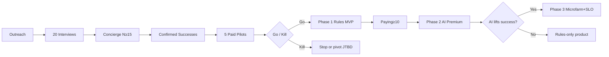

# 13 — Roadmap & Backlog

**Date:** 2026-08-15  
**Method:** VALIDATE FIRST · gates with exit **and** kill criteria  
**Capacity scenarios:** 8 h/wk · 15 h/wk · 30 h/wk (founder + AI tools combined)  
**Separation:** Validation work ≠ Implementation work (do not conflate).

---

## 1. Capacity model

| Scenario | Hours/week | Realistic weekly output | Label |
|---|---|---|---|
| A — Survival | 8 | 1 pilot **or** 1 content piece **or** thin code spike | **FACT** (time budget) |
| B — Serious side | 15 | pilot + content **or** thin MVP slice | **ASSUMPTION** |
| C — Near full focus | 30 | parallel validation + implementation | **ASSUMPTION** |

**INFERENCE:** R$40k MRR is incompatible with Scenario A on a short horizon; Scenario A can only buy learning.

### Effort units

1 **EU** = ~4 hours of deep work.  
Use EU for backlog sizing (not story points theater).

---

## 2. Phases 0–4 (gates)

### Phase 0 — Problem & WTP validation (no product code required)

| | |
|---|---|
| **Objective** | Confirm WTP + A1 Mini wedge via pilots (pain from community memo) |
| **Validation work** | Community memo sign-off, concierge recipes, 5 paid pilots, cost tracking |
| **Implementation work** | Spreadsheet/Notion ops only; optional landing page copy |
| **Exit (pass)** | ≥5 paid pilots; actionability ≥3/5; ≥30% success among feedback; clear JTBD from community themes |
| **Kill** | See `00-executive-decision.md` (no interview quota) |
| **Duration EU** | ~25–40 EU total (faster without interviews) |

| Capacity | Calendar estimate |
|---|---|
| 8 h/wk | 20–30 weeks |
| 15 h/wk | 11–16 weeks |
| 30 h/wk | 6–8 weeks |

---

### Phase 1 — Skeleton product (rules-first MVP)

| | |
|---|---|
| **Objective** | Self-serve: upload → rules recipe → confirm outcome |
| **Validation work** | Usability with pilots; activation metrics |
| **Implementation work** | Auth, upload, rules engine port, recipe UI, Stripe/Pix, events |
| **Exit (pass)** | 20 activated users; ≥10 paying; P95 analyze rules ≤8s; Playwright smoke green |
| **Kill** | Activation <10% of signups **or** upload failure >20% sustained |
| **Duration EU** | ~80–120 EU |

| Capacity | Calendar (after Phase 0) |
|---|---|
| 8 h/wk | 40–60 weeks (high risk — consider pause) |
| 15 h/wk | 22–32 weeks |
| 30 h/wk | 11–16 weeks |

**DECISION:** Do not start Phase 1 implementation until Phase 0 exit passes.

---

### Phase 2 — AI premium (guarded)

| | |
|---|---|
| **Objective** | AI explanations + suggestions constrained by rules core |
| **Validation work** | Blind A/B: rules-only vs rules+AI on print success |
| **Implementation work** | LLM gateway, credits, eval harness, prompt versioning |
| **Exit (pass)** | AI cohort success ≥ rules-only; COGS <25% ARPU; safety eval 100% |
| **Kill** | AI does not lift success **or** COGS >40% ARPU **or** safety misses |
| **Duration EU** | ~60–90 EU |

---

### Phase 3 — Hardening & Microfarm

| | |
|---|---|
| **Objective** | Reliability SLOs + Microfarm quoting/consistency |
| **Validation work** | 10 Microfarm interviews; quote tool pilots |
| **Implementation work** | Observability SLOs, fuzz/property, team seats light, quote calculator |
| **Exit (pass)** | SLO 99% met 60d; ≥15 Microfarm paying; NPS/qual positive |
| **Kill** | Microfarm WTP fails; isolation/security incident |
| **Duration EU** | ~70–100 EU |

---

### Phase 4 — Expansion (any-FDM aspiration begins)

| | |
|---|---|
| **Objective** | Second printer family **or** EN market **or** partner channel |
| **Validation work** | Separate problem interviews for new segment |
| **Implementation work** | Printer profiles expansion, i18n, partnerships |
| **Exit (pass)** | New segment ≥20 paying without destroying A1 Mini quality |
| **Kill** | Dilution: A1 Mini success rate drops; support load unsustainable solo |
| **Duration EU** | TBD after Phase 3 |

**DECISION:** Any-FDM is Phase 4+, not MVP. A1 Mini remains wedge.

---

## 3. Validation vs implementation backlog

### 3.1 Validation epics (Phase 0 priority)

| Epic | Stories | EU | Priority |
|---|---|---|---|
| **V0.1 Community memo** | Sign-off on internet pain themes (02) | 2 | P0 |
| **V0.2 Concierge factory** | Offer, intake, recipe template, outcome log | 10 | P0 |
| **V0.3 Five paid pilots** | Convert ≥5; score actionability + success | 16 | P0 |
| **V0.4 Landing smoke** | Sample report + waitlist/CTA | 6 | P0 |
| **V0.5 Content seeds** | 5 PT guides from community themes | 10 | P1 |
| **V0.6 Cost model** | OpenAI/Stripe/Supabase unit economics | 4 | P0 |
| **V0.7 Kill review** | Formal go/no-go doc | 2 | P0 |

### 3.2 Implementation epics (only after Phase 0 pass)

| Epic | Stories | EU | Priority | Phase |
|---|---|---|---|---|
| **I1.1 Auth & tenancy** | Supabase Auth, orgs Hobby/Microfarm | 10 | P0 | 1 |
| **I1.2 Upload & storage** | Signed upload, size limits, virus/fuzz basics | 12 | P0 | 1 |
| **I1.3 Rules engine** | Port capability gates + profile picker from wiki/core | 20 | P0 | 1 |
| **I1.4 Recipe UX** | PT-BR recipe view, export checklist, Studio mapping | 16 | P0 | 1 |
| **I1.5 Billing BR** | Stripe + Pix, Billing 0.7%, plans | 14 | P0 | 1 |
| **I1.6 Outcome loop** | `print_confirmed_success` capture | 6 | P0 | 1 |
| **I1.7 Telemetry** | English events, privacy scrubbers | 8 | P0 | 1 |
| **I1.8 E2E smoke** | Playwright critical path | 6 | P1 | 1 |
| **I2.1 LLM gateway** | template_id, credits, cost caps | 14 | P0 | 2 |
| **I2.2 Eval harness** | Golden + safety suites | 12 | P0 | 2 |
| **I2.3 AI UX** | Explain/suggest with “rules overruled” UI | 12 | P0 | 2 |
| **I3.1 Quote tool** | Microfarm deterministic quote | 16 | P0 | 3 |
| **I3.2 SLO dashboards** | Error budget burn alerts | 8 | P1 | 3 |
| **I3.3 Property+fuzz** | Parser hardening | 10 | P1 | 3 |
| **I4.1 Second printer** | Registry expansion | 20 | P2 | 4 |

---

## 4. Prioritized story slice (next 90 days — validation only)

Assuming Phase 0 not yet passed:

| Week band | 8 h/wk | 15 h/wk | 30 h/wk |
|---|---|---|---|
| 1–2 | Landing draft + outreach list | Landing live + 2 pilot offers | Landing + 5 offers |
| 3–4 | 2 concierge | 3 paid pilots | 5 paid pilots |
| 5–6 | Finish 5 pilots | Cost model + case notes | Kill/go memo |
| 7–8 | Kill/go | Phase 1 spike if pass | Phase 1 parallel |
| 9–12 | Continue pilots | Pilot close + SEO pillars | Phase 1 spike **only if pass** |

---

## 5. Critical path

**Critical path bottleneck:** confirmed successful prints (not code velocity).

**DECISION:** Any implementation that skips D→E is a process violation.

---

## 6. Dependencies & risks

| Risk | Impact | Mitigation | Label |
|---|---|---|---|
| Solo bandwidth | Miss gates | Cap WIP=1 epic | **FACT** |
| Bambu AGPL / plugin ecosystem | Legal confusion | Deliver recipes for Studio UI; avoid violating plugin boundaries | **INFERENCE** |
| Free slicer “good enough” | No WTP | Compete on outcomes/time, not features | **HYPOTHESIS** |
| AI COGS | Margin death | Caps + rules-first path | **ASSUMPTION** |
| BR payments friction | Checkout drop | Pix primary | **DECISION** |
| R$40k MRR pressure | Premature build | Separate aspiration metric from kill gates | **DECISION** |

---

## 7. Backlog hygiene rules

1. Every item tagged `validation` or `implementation`.  
2. No `implementation` P0 while Phase 0 open.  
3. Each story lists **acceptance** + **telemetry event**.  
4. English identifiers for code/events; PT-BR for user copy.  
5. Re-estimate EU after first 3 concierge jobs (learning).

---

## 8. Near-term DECISIONS baked into roadmap

| ID | Decision |
|---|---|
| R-D1 | A1 Mini wedge through Phase 3 |
| R-D2 | Rules core before AI premium |
| R-D3 | Brazil-first content & billing (Pix) |
| R-D4 | Hobby + Microfarm dual segment, Hobby acquisition wedge |
| R-D5 | Free slicers as execution partners, not enemies |
| R-D6 | VALIDATE FIRST gates enforce kill criteria |
